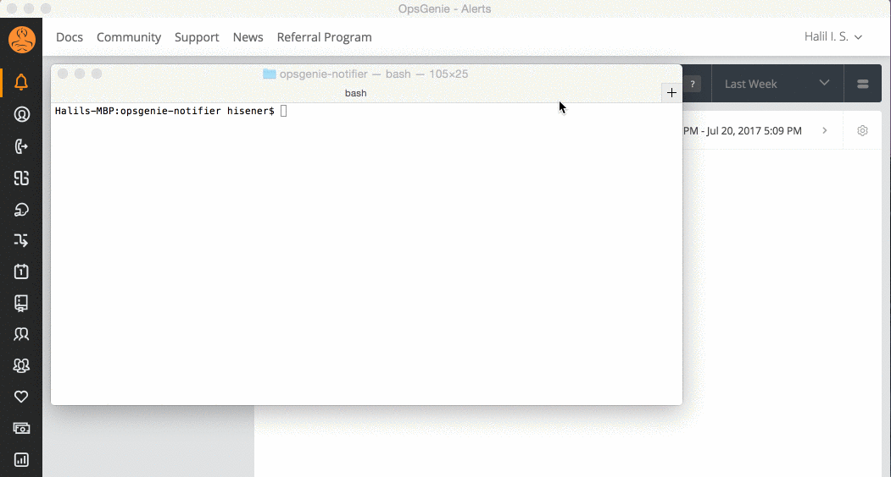

# OpsGenie Notifier

Experimental OpsGenie Alert notifications on native desktop.

[![Build Status][travis-image]][travis-url]
[](https://codeclimate.com/github/hisener/opsgenie-notifier)
[](http://standardjs.com/)

[travis-image]: https://travis-ci.org/hisener/opsgenie-notifier.svg?branch=master
[travis-url]: https://travis-ci.org/hisener/opsgenie-notifier



## Requirements
- Node.js 6+

## Install and start
```bash
git clone https://github.com/hisener/opsgenie-notifier.git
cd opsgenie-notifier
npm install
# Set your API key in .env
npm start
```

## Known issues
- Notifications disapper after 5s and it cannot changeable. mikaelbr/node-notifier/#172

## Credits
- [node-notifier](https://github.com/mikaelbr/node-notifier) for sending notifications
- [opsgenie-sdk](https://github.com/opsgenie/opsgenie-nodejs-sdk)

## TODO
- [x] Demo gif/photo
- [ ] package.json bin

## License

[MIT. Copyright (C)](LICENCE) [Halil İbrahim Şener](http://halilsener.com).
